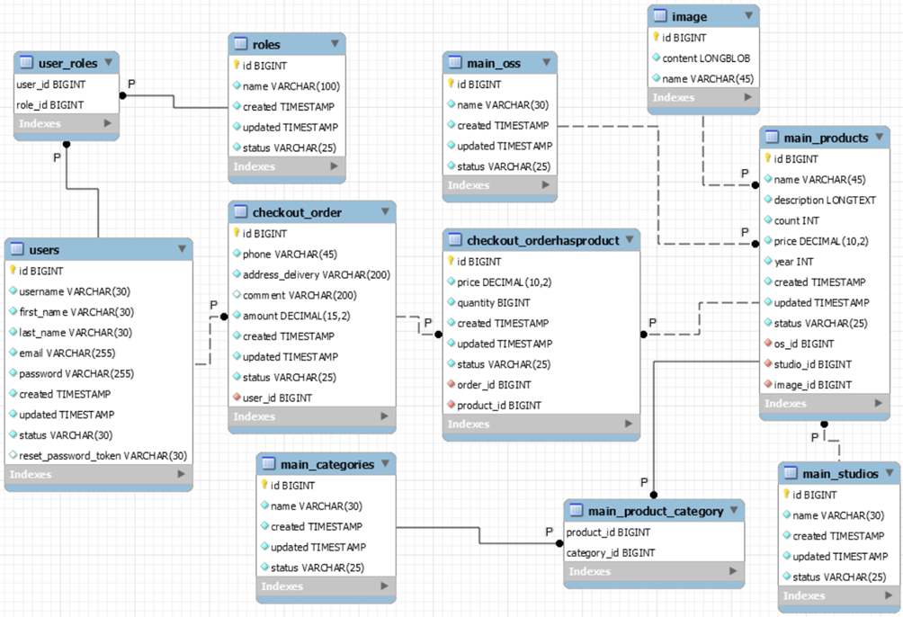

  GameShop

The user should be able to view their orders in their profile on the website to see exactly what they have purchased and how much it cost. 
In case of any questions, they should be able to contact the administrators of the information system to resolve them.
In accordance with this subject area, the following business processes in the company's activities are distinguished:
- customer basket formation;
- placing an online order;
- accounting of customer orders;
- processing of customer orders by a manager or administrator.
  Business functions for each of the processes:
- select the desired products, edit the quantity, delete products from the cart;
- create a customer basket, place an order, process an order;
- enter the necessary data for the order, place the order;
- contact the customer after placing the order, if he/she wanted it or it is necessary to confirm and clarify the customer's data, adjust 
the order details, confirm or cancel the order.
  There are four types of users in this IS: unregistered users, registered users, who can be a customer, manager, or administrator. 
For unregistered users, the following business functions are presented: viewing goods in the catalog on the site, filtering these goods 
by category according to their requirements, the ability to register and log in to the site. A registered user, i.e. a customer, can do
everything that an unregistered user can do, including selecting products, editing their quantity when creating a shopping cart, entering 
the necessary data to place an order, viewing their order history, changing their profile information on the website, and changing their 
password to enter the website. The manager has the ability to view all user orders in order to start processing them by phone if the customer
prefers it, or if it is simply necessary to clarify the details of the customer's order to ensure that the customer is satisfied after using
this information system. The administrator has full access to all functions of the information system.

## The main functionalities of the system on the front end for customers are:
 viewing the entire catalog of computer games;
 search for the desired game using filters. You can filter by one parameter or several at once;
 view full information about the game you are interested in;
 to register in the system by entering your name, surname, email, etc;
 log in to the system by entering your username and password;
 add the desired games to the cart both from the main page, i.e. the catalog with all games, and from the page with a specific game;
 view the cart and edit the number of items in the cart;
 create an order, indicating the address, phone number and, if necessary, a comment for the manager.
 view all orders in your profile;
 editing your profile, i.e. changing your login, first name, last name, email, and password;
 password recovery is done by specifying the mailbox to which you will receive a password recovery message with a link. After clicking on the link, you need to specify a new password.

## The main functionalities of the system from the front end for the manager are:
 view all orders;
 filtering orders by date, status, searching for orders by a specific customer;
 viewing the desired order and the ability to change the order status;
 to view information about the game contained in the order.

## The main functionalities of the system for the frontline administrator are:
 all the options available to customers and managers;
 to view all users in the system. A separate page for the administrator, where he can filter users and find the right one by his login;
 setting the status of the client, i.e. active or blocked. If the user is set to the blocked status, then he or she will receive a notification during authorization that he or she is blocked and what to do;
 to set and edit the user's role in the system. The administrator can assign a manager or another administrator to the system;
 editing the catalog with computer games, by adding new ones, changing information about the products, changing the status of the product to active or inactive to notify the user about the availability of the product;
 to view all orders in the system.

## The main functionalities of the system on the backend are:
 register in the system. Unique: email and user login;
 to log in with a username and password;
 to recover the password by specifying the email to which a password recovery notification with a link to the recovery page will be sent;
 administration of goods in the system, by adding new ones, updating information about existing ones;
 creating and processing orders by changing the order status;
 notifications by e-mail about the created order;
 administration of system users by changing attributes and setting a certain status;

Database Schema:
